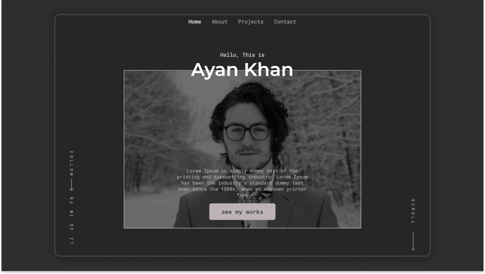

# My Portfolio website [React Project]

## Live Preview: [Open Link][preview]

Coded by - [Daniel Slobodscoy] [web](http://my-website.com)



## Project Details

A portfolio for a web designer. I used React js to make this portfolio. A clean design with full responsiveness. You will find this portfolio very professional. Also, there is smooth scroll in the portfolio which will make the scroll experience really elegant.

This is a beginner-friendly react js project. React Js is one of the hottest techs for web dev. Through this project, we will have a good understanding of react js. Besides React js we are going to use many other techs.

## Project Requirement

1. HTML, CSS
1. JavaScript
1. React Basic

## What we are going to Use/learn

- React
- React Hooks
- Styled Components
- Swiper js
- React Transition Group
- Smooth Scrollbar
- React Icons
- React Router Dom
- More...

## Starter Files

For the starter files, we created a `branch` in this repository named `name_file`. You need to change the branch in the top corner of the repo then you will get the starter files and now you can clone the repo or `download` it.

## Getting Started

Clone this repository.

After getting the starter files, you need to go the file directory and run

```shell
npm install
```

and after that start the live server.

```shell
npm start
```